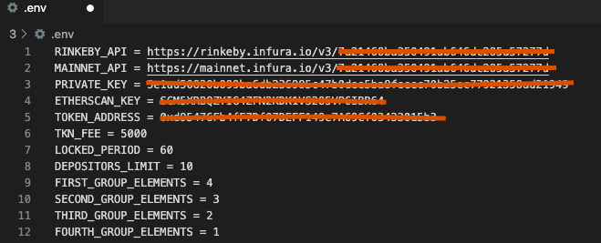
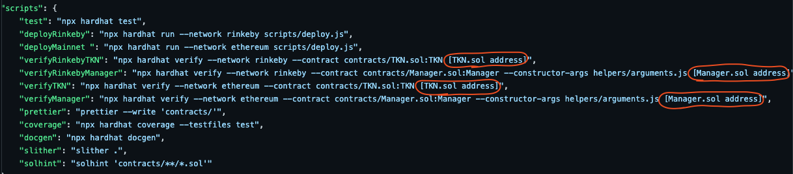
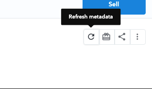

# 🤵 Manager NFT generator 🤵
> There are 3 contracts: Manager.sol for managing, Token.sol with erc-20 implementation and ERC721.sol with ERC721 standard implementation

## 📁 Table of Contents
* [General Info](#-general-information)
* [Technologies Used](#-technologies-used)
* [Features](#-features)
* [Requirements For Initial Setup](#-requirements-for-initial-setup)
* [Setup](#-setup)
* [Contact](#-contact)


## 🚩 General Information
- Each user wishing to participate must purchase 5,000 standard "TKN" erc-20 tokens
- To participate, each user must deposit these tokens into the ManagerContract via the deposit function
- After that, the tokens will be locked for a minute, after which the user can call the createNFT function and pass the image URI as a parameter
- NFT will be minted for the user and image metadata will be added after all 10 tokens are minted
- The owner of the Token contract earns 0.0001 ETH for each "TKN" token and can withdraw "TKN" from the Manager contract after unlocking the tokens.


 
## 💻 Technologies Used
- ipfs
- hh coverage
- slither
- docgen
- solhint

## 🌟 Features
- Users could create custom NFTS
- Total supply of 10 NFTs
- The metadata is updated only once after the tokens are minted
- 100% coverage of tests

## 👀 Requirements For Initial Setup
- Install [NodeJS](https://nodejs.org/en/), should work with any node version below 16.16.0
- Install [Hardhat](https://hardhat.org/)

## 📟 Setup
### 1. 💾 Clone/Download the Repository
### 2. 📦 Install Dependencies:
```
$ cd repository_file
$ npm install
```
### 3. 🔍 .env environment variables required to set up
Create .env file inside project folder
- You can get your ethereum or testnet API key [here](https://infura.io/dashboard/ethereum),[here](https://www.alchemy.com) or any other service that allow you to connect to the nodes
- You can get your private key from your wallet (Don't share your private key with untrusted parties) 
- You can get your etherscan API -key [here](https://etherscan.io/myapikey).
- TOKEN_ADDRESS(address of TKN) be available after deploying contracts
```
RINKEBY_API = <Rinkeby API key>
MAINNET_API = <Ethereum mainnet API key>
PRIVATE_KEY = <Private key of your wallet u want to deploy contracts from>
ETHERSCAN_KEY = <Etherscan API key in order to verify your contracts>
TOKEN_ADDRESS = <Address of deployed TKN.sol contract>
TKN_FEE = <Constructor parameter fee in TKN tokens in order to create custom NFT>
LOCKED_PERIOD = <Constructor parameter period in seconds indicating how long deposited TKN tokens will be locked>
DEPOSITORS_LIMIT = <Constructor parameter limit of depositors for the contract>

// All tokens are divided into 4 groups, each has its own percentage level of rarity
// For example: first group = 4, second = 3, third = 2 and fourth = 1.
// 4 means 40%, 3 means 30% and so on
// FIRST_GROUP_ELEMENTS + SECOND_GROUP_ELEMENTS + THIRD_GROUP_ELEMENTS + FOURTH_GROUP_ELEMENTS always must be 10

FIRST_GROUP_ELEMENTS = 4
SECOND_GROUP_ELEMENTS = 3
THIRD_GROUP_ELEMENTS = 2
FOURTH_GROUP_ELEMENTS = 1
```



### 4. ⚠️ Run Tests
```
$ npm run test
```

```
$ npm run coverage
```

### 5. 🚀 Deploy to Rinkeby or Mainnet
```
$ npm run deployRinkeby
``` 
```
$ npm run deployMainnet 
``` 

!!!Important!!! 
insert current token contract address into your environment variables

### 6. ✏️ Insert current contract addresses into package.json


### 7. 📜 Verify contracts
```
$ npm run verifyRinkebyTKN 
```

```
 $ npm run verifyRinkebyManager
```
or for mainnet
```
$ npm run verifyTKN
```

```
 $ npm run verifyManager
```

### NOTE
In order to quick update of Metadata on opensea page just click "Refresh Metadata" button





## 💬 Contact
Created by [@LESKOV](https://www.linkedin.com/in/ivan-leskov-4b5664189/) - feel free to contact me!


