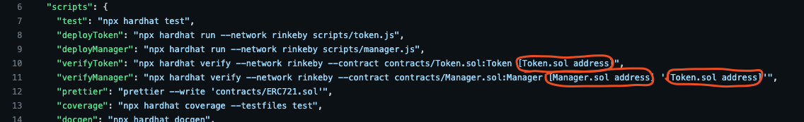

# Manager NFT generator
> There are 3 contracts: Manager.sol for managing, Token.sol with erc-20 implementation and ERC721.sol with ERC721 standard implementation

## Table of Contents
* [General Info](#general-information)
* [Technologies Used](#technologies-used)
* [Features](#features)
* [Requirements For Initial Setup](#requirements)
* [Setup](#setup)
* [Contact](#contact)


## General Information
- Each user wishing to participate must purchase 5,000 standard "TKN" erc-20 tokens
- To participate, each user must deposit these tokens into the ManagerContract via the deposit function
- After that, the tokens will be locked for a minute, after which the user can call the createNFT function and pass the image URI as a parameter
- NFT will be minted for the user and image metadata will be added after all 10 tokens are minted
- The owner of the Token contract earns 0.0001 ETH for each "TKN" token and can withdraw "TKN" from the Manager contract after unlocking the tokens.


 
## Technologies Used
- ipfs
- hh coverage
- slither
- docgen
- solhint

## Features
- Users could create custom NFTS
- Total supply of 10 NFTs
- The metadata is updated only once after the tokens are minted
- 100% coverage of tests

## Requirements For Initial Setup
- Install [NodeJS](https://nodejs.org/en/), should work with any node version below 16.16.0
- Install [Hardhat](https://hardhat.org/)

## Setup
### 1. Clone/Download the Repository
### 2. Install Dependencies:
```
$ cd repository_file
$ npm install
```
### 3. .env environment variables required to set up

### 4. Run Tests
`$ npm run test`

`$ npm run coverage`

### 5. Deploy to Rinkeby
`$ npm run deployToken ` 
!!!Important!!! 
insert current token contract address into your environment variables

`
 $ npm run deployManager
 `
### 6. Insert current contract addresses into package.json


### 7. Verify contracts
`$ npm run verifyToken `


 `
 $ npm run verifyManager
 `

### NOTE
In order to quick update of Metadata on opensea page just click "Refresh Metadata" button


## Contact
Created by [@LESKOV](https://www.linkedin.com/in/ivan-lieskov-4b5664189/) - feel free to contact me!
